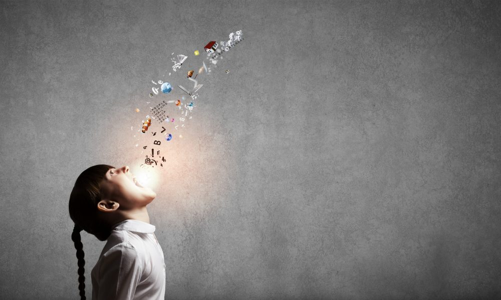

Let it out! Not you, me! Ok, no need for exclamation marks, you get the point. I'm yelling at myself, because my mind is filled with ideas, thoughts, and emotions and like the image above, I need to release them but it's not always clear as to what is the best medium or format to express oneself. 

You see, I can be a very selfish person, in fact my purpose for blogging is not to express myself to the world, but to talk to myself, albeit, more formally than usual. I'd also like to come back and see a record of the conversations with myself from anywhere, hence the use of an online blog rather than a physical journal.

The greatest benefit of blogging in my overly strong opinion lies in the act of self communication. No citation, I came up with that myself. Truthfully though, all communication is self communication. However, there is something about blogging or keeping a written journal that is especially beneficial to the mind. 

Specifically, the creative experience that results from the effort placed into word selection and crafting the ideal formation of your ideas into a coherent structure. Of course, one that precisely represents the experiences and feelings you seek to birth into your readers mind.

Unfortunately, this representation doesn't always convert well,afterall, you're competing against an array of symbols mapped to an even greater array of associatons which produces an infite amount of interpretations, differences in culture and language understanding, it is mind boggling to me, how we as human beings ever achieve any form of synchronization. 

It's possible that we never do achieve complete harmony in our understanding of each other, and that we live our lives through persistent barriers, and only partially understanding each other, and filling in the blanks whenever we can. The thought inspires the following question, if we lack harmony with each other, how much do we understand about ourselves? Are we fully synchrounized with our own minds?

In my case, I relish the recursive nature of it all, as creator and recipient of my own thoughts, I can sit here, concious of this amazing cycle and in admiration of the perfect feedback loop, the self. 

